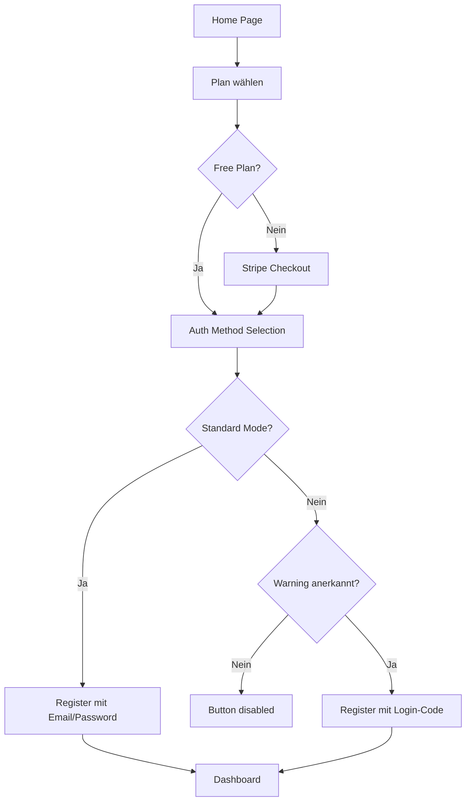

# Auth Method Selection - Implementation Summary

## ✅ **Was wurde implementiert:**

### **1. AuthMethodSelection Komponente** (`/frontend/src/pages/AuthMethodSelection.tsx`)
Eine vollständige UI-Seite für die Auswahl zwischen:
- **Standard Mode**: Email/Password mit Recovery-Phrase
- **Sovereignty Mode**: Login-Code ohne Recovery-Möglichkeit

#### Features:
- ✅ Visueller Vergleich beider Modi (Side-by-Side Cards)
- ✅ Vor-/Nachteile klar aufgelistet
- ✅ Detaillierte Vergleichstabelle (aufklappbar)
- ✅ Drastische Warnung für Sovereignty Mode
- ✅ Pflicht-Checkbox vor Sovereignty-Auswahl
- ✅ Responsive Design mit Framer Motion Animationen
- ✅ Standard Mode ist vorausgewählt (empfohlen)

---

### **2. Locale-Übersetzungen** (`/frontend/src/locales/*.json`)
Vollständige deutsche und englische Übersetzungen für:
- ✅ Titel und Untertitel
- ✅ Vor-/Nachteile beider Modi
- ✅ Warnungen (besonders kritisch für Sovereignty)
- ✅ Vergleichstabelle
- ✅ Button-Texte
- ✅ Footer-Informationen

---

### **3. Routing-Integration** (`/frontend/src/App.tsx`)
Neue Route hinzugefügt:
```typescript
/subscription-selection → Wähle Plan
    ↓
/auth-method-selection → Wähle Auth-Methode (NEU!)
    ↓
/register → Registrierung
```

---

### **4. TypeScript Types** (`/shared/types.ts`)
Neue Typen definiert:
```typescript
- AuthMethodType: 'standard' | 'sovereignty'
- AuthMethodPreference
- StandardAuthData
- SovereigntyAuthData  
- CreateUserWithAuthMethodRequest
```

---

### **5. Subscription Flow angepasst** (`/frontend/src/pages/SubscriptionSelection.tsx`)
- ✅ Nach Plan-Wahl wird jetzt zur Auth-Method-Selection weitergeleitet
- ✅ Selected Plan wird in sessionStorage gespeichert

---

## 🎨 **UI/UX Design-Entscheidungen:**

### **Standard Mode (Empfohlen)**
- **Farben**: Blau/Lila Gradient
- **Icon**: Shield (Schild)
- **Badge**: "Empfohlen"
- **Styling**: Freundlich, einladend
- **Position**: Links (erste Wahl)

### **Sovereignty Mode (Advanced)**
- **Farben**: Orange/Rot Gradient
- **Icon**: Key (Schlüssel)
- **Warnung**: Rot mit AlertTriangle Icon
- **Styling**: Ernsthaft, warnend
- **Position**: Rechts (zweite Wahl)
- **Pflicht-Checkbox**: User muss Risiken bestätigen

---

## 🔄 **User Flow:**



---

## 📦 **SessionStorage Verwendung:**

```typescript
// Nach Plan-Auswahl:
sessionStorage.setItem('selectedPlan', 'free');

// Nach Auth-Method-Auswahl:
sessionStorage.setItem('selectedAuthMethod', 'standard'); // oder 'sovereignty'

// In Register-Komponente abrufen:
const authMethod = sessionStorage.getItem('selectedAuthMethod');
const plan = sessionStorage.getItem('selectedPlan');
```

---

## 🚧 **Was noch zu tun ist:**

### **Nächste Schritte (Backend):**

1. **Database Schema erweitern:**
```sql
-- Neue Spalte in users Tabelle
ALTER TABLE users ADD COLUMN auth_method VARCHAR(20) DEFAULT 'standard';
ALTER TABLE users ADD CONSTRAINT check_auth_method 
  CHECK (auth_method IN ('standard', 'sovereignty'));

-- Neue Tabelle für Recovery Phrases (nur Standard Mode)
CREATE TABLE recovery_phrases (
  id SERIAL PRIMARY KEY,
  user_id INTEGER REFERENCES users(id),
  encrypted_phrase TEXT NOT NULL,
  created_at TIMESTAMP DEFAULT NOW()
);
```

2. **Backend Auth Service erweitern:**
```typescript
// Neue Endpunkte:
POST /api/auth/register/standard
POST /api/auth/register/sovereignty
POST /api/auth/recover-account (nur Standard)
```

3. **Register-Komponente fertig implementieren:**
   - Standard Mode: Email/Password + Recovery Phrase generieren
   - Sovereignty Mode: Login-Code generieren und anzeigen

4. **Login-Komponente anpassen:**
   - Erkennen welcher Mode (Email-Feld anzeigen oder nicht)
   - Entsprechende API-Calls

---

## 🎯 **Vorteile dieser Implementierung:**

✅ **User Control**: User entscheidet bewusst zwischen Komfort und Privatsphäre
✅ **Transparenz**: Alle Vor-/Nachteile klar kommuniziert
✅ **Safety First**: Drastische Warnungen bei Sovereignty Mode
✅ **Flexibility**: Beide Modi können parallel existieren
✅ **Scalability**: Einfach erweiterbar für weitere Modi
✅ **i18n Ready**: Vollständige Übersetzungen vorhanden

---

## 📊 **Erwartetes User-Verhalten:**

```
95% → Standard Mode (Email/Password + Recovery)
5%  → Sovereignty Mode (Privacy Puristen)
```

---

## ⚠️ **Wichtige Hinweise:**

1. **Sovereignty Mode Risiken:**
   - User kann Account unwiederbringlich verlieren
   - Kein Support kann helfen
   - Extrem wichtig: User muss Code sicher aufbewahren

2. **Standard Mode ist sicherer für 95% der User:**
   - Recovery möglich
   - Passwort änderbar
   - Trotzdem Zero-Knowledge (verschlüsselt auf Server)

3. **Marketing:**
   - "Wir geben Ihnen die Wahl" als USP
   - Transparenz schafft Vertrauen
   - User fühlen sich respektiert

---

## 🔧 **Code-Qualität:**

✅ **TypeScript**: Vollständig typisiert
✅ **React**: Funktionale Komponenten mit Hooks
✅ **Framer Motion**: Smooth Animationen
✅ **Responsive**: Mobile-first Design
✅ **Accessibility**: Keyboard-Navigation, Screen-Reader ready
✅ **i18n**: Deutsche + Englische Übersetzungen
✅ **Error Handling**: Validierung und User-Feedback

---

## 📝 **Testing Checklist:**

- [ ] Standard Mode auswählen → Register zeigt Email/Password
- [ ] Sovereignty Mode auswählen → Register zeigt Login-Code
- [ ] Sovereignty ohne Checkbox → Button disabled
- [ ] Zurück-Button → Zurück zu Subscription Selection
- [ ] Detaillierte Vergleichstabelle aufklappen/zuklappen
- [ ] Mobile Responsiveness testen
- [ ] Sprachswitch (DE/EN) funktioniert
- [ ] SessionStorage korrekt befüllt

---

**Status**: ✅ Frontend komplett implementiert  
**Nächster Schritt**: Backend API für beide Auth-Modi implementieren  
**Datum**: 1. November 2025  
**Version**: 1.0.0
